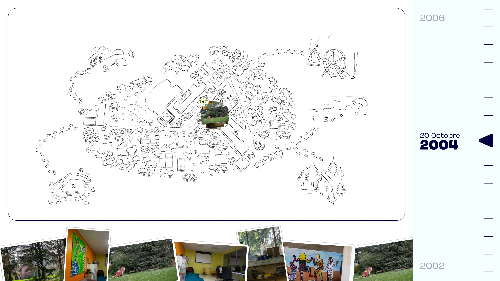

# 🧠 memoridef



`memoridef` est un dispositif d'archivage et de mémoire collective développé durant le Workshop à L'EDEF. 
un éducateur anime un atelier où les participants téléversent leurs images depuis leur téléphone, puis les placent ensemble sur une **carte** et une **timeline** pour constituer une archive collective.

> ⚠️ **Application [vibe codée](https://en.wikipedia.org/wiki/Vibe_coding)**, c'est-à-dire co-construite avec l'aide d'un LLM. Une vigilance accrue est de mise :
>
> - **Relire le code généré** avant toute modification ou mise en production
> - **Ne pas déployer en l'état** sans audit, en particulier sur un environnement exposé ou contenant des données sensibles
> - **Ne pas accorder de confiance par défaut** au comportement de l'application : tester, valider, et challenger


## Installation

### 🐋 Docker Compose (recommandé)

```bash
git clone -b dev https://github.com/urbanlab/memoridef.git
cd memoridef
docker-compose up 
```

Une fois lancé :

- Frontend : <http://localhost:5173>
- API : <http://localhost:8001> · documentation interactive sur <http://localhost:8001/docs>

## Licence

MIT — voir [`LICENSE`](LICENSE).
